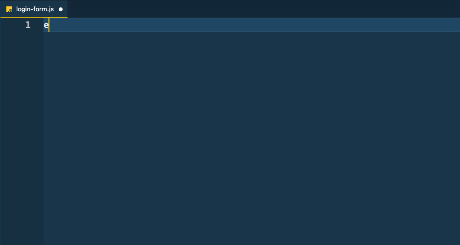

## Enhance Snippets

### Quickly author code in your Enhance project with custom snippets

#### New file helpers

| Trigger  | Content |
| -------: | ------- |
| `eelem→` | Export a default custom element with `html` |
| `etelem→` | Export a JSDoc typed default custom element with `html` |

#### Development

Snippet Docs: https://code.visualstudio.com/docs/editor/userdefinedsnippets#_snippet-syntax  
Based on: https://github.com/microsoft/vscode-extension-samples/tree/main/snippet-sample  
Samples: https://github.com/xabikos/vscode-javascript/blob/master/snippets/snippets.json  
